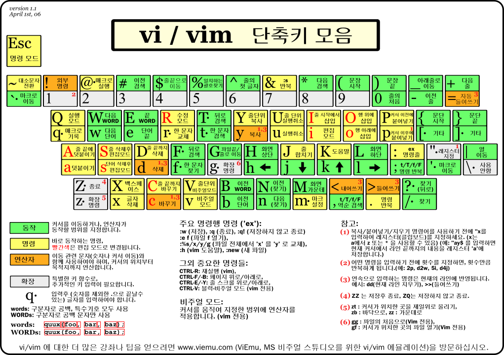

> 해당글은 [이것이 우분투 리눅스다 ]를 공부하면서 정리한 글입니다.  

# 리눅스 기초 개념들

## 시작하기 전에
* 유닉스/리눅스의 명령어는 대문자와 소문자를 명확하게 구분한다.
* `#` 프롬프트는 root 사용자
* `$` 프롬프트는 일반 사용자

## 가상 콘솔
* 가상의 모니터. `ctrl` + `alt` + `f2` ~ `f7`로 화면을 자유롭게 이동할 수 있다. 2번은 X 윈도로, 나머지는 텍스트 모드로 제공된다.

## 런레벨
* `init` 명령어 뒤에 붙는 숫자를 런레벨이라고 한다.  
  
|런레벨|영문 모드|설명|비고|
|:----:|:----:|:-----:|:-----:|
|0|Power Off| 종료 모드| |
|1|Rescue| 시스템 복구 모드| 단일 사용자 모드|
|2|Multi-User| | 사용하지 않음|
|3|Multi-User| 텍스트 모드의 다중 사용자 모드| |
|4|Multi-User| | 사용하지 않음|
|5|Graphical| 그래픽 모드의 다중 사용자 모드| |
|6|Reboot| | | 

런레벨 모드를 확인하려면 `/lib/systemd/system` 디렉터리의 `runlevel?.target` 파일을 확인

## 자동 완성과 히스토리
* `tab`키를 누르면 나머지 파일명이 자동으로 완성된다. 디렉터리 또는 파일이 2개 이상 존재하면 자동완성이 되지 않는다. 자동완성 기능은 속도를 올려주기도 하지만 더 중요한건 정확성이 높아져 실수를 줄일 수 있다. 

* 도스 키는 이전에 입력한 명령어를 상/하 화살표 키를 이용해서 다시 나타내는 기능을 말한다. 

## 에디터
* gedit, nano, vi 에디터를 사용한다.

  * `nano -c 파일이름` 명령으로 실행하면 커서가 움직일 때마다 아래쪽에 자동으로 행번호가 표시된다. 
  * vi 사용시 `I` 또는 `A`를 눌러서 입력모드로 바꿔 문서를 수정하고, `ESC`를 눌러서 명령모드로 바꾼뒤 `:wq`를 입력하여 저장하고 종료한다. 저장하지 않고 에디터를 닫으려면 `:q!`를 입력한다.   

### 🚫 vi 에디터에서 방향키 사용시 발생할 수 있는 문제
우분투 리눅스의 문제인지 vi 에디터에서 백스페이스와 화살표 키가 먹히지 않고 키값이 입력되는 현상이 발생하였다. 이 때 터미널에서   
```bash
sudo apt-get install vim
``` 
명령어를 사용해서 vim을 다시 설치하면서 해결하였다. 원래 vi에서는
방향키를 사용하지 않았었기 때문에 발생하는 오류로 보인다.

### vi/vim 단축키 모음
* 문자열 치환 =>  `:%s/기존문자열/새문자열` 
* 에디터 앞에 행 번호 표시 => `:set number`


출처) 원본: http://www.viemu.com/a_vi_vim_graphical_cheat_sheet_tutorial.html   
번역본: https://kldp.org/node/102947

## 도움말 사용법
* man <명령어> 로 사용한다. 
* 행 이동은 `↑, ↓` 혹은 `K, J`를 사용하고, 페이지 단위로 이동하려면 `Page Up, Page Down` 혹은 `Space bar, B`를 사용한다.

## 마운트와 CD/DVD, USB의 활용
* 마운트란 물리적인 장치를 특정한 위치(대개는 디렉터리)에 연결시켜주는 과정
    * `mount` 명령어로 현재 마운트된 장치들을 확인할 수 있다
    * 마운트 설정: `mount -o[옵션][디바이스명][마운트할 디렉토리]`
    * 마운트 해제: `umount -o[옵션][디바이스명 혹은 마운트한 디렉토리` 
    * 